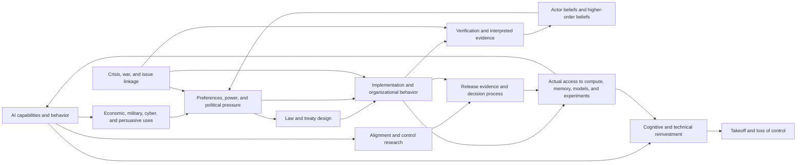

# Causal map

This is an index of interfaces, not a claim that the world is a sparse directed acyclic graph.

## Core systems

### Capability production

Effective computation, algorithms, data, scaffolds, inference-time work, human labor, and organizational processes jointly produce a ragged capability profile. A central g-like factor is a useful within-paradigm summary, not a sufficient takeoff model. Benchmarks are observations of task thresholds and saturation, not independent redraws from “capability.”

The crucial interfaces are whether a system can perform AI research, preserve improvements, acquire experimental access, and compress the time required for another improvement below the response time of its controllers.

### Access and compute control

Treaty text changes danger only through implementation. Relevant states include ownership, custody, credentials, power, network access, workload permission, monitoring, stop authority, component disposition, and legal enforcement latency. Compute-only restrictions can be substituted around through memory, distributed training, algorithmic efficiency, existing weights, inference-time search, or hardware reconstruction.

### Institutions and politics

The treaty is not a single health meter. Different actors have different beliefs, authorities, skills, interests, constituencies, and information. Persistence can fail through deliberate withdrawal, exemption bargaining, capture, ordinary implementation failure, false higher-order beliefs, crisis displacement, or loss of physical access without any leader choosing “resume the race.”

### Technical safety and exit

Safety is candidate-specific and threat-model-specific. Evidence passes through evaluator selection, access, incentives, interpretive schools, dissent filtering, and institutional authorization. A release can be legally authorized and institutionally endorsed while its required technical claims are false.

## High-value interfaces

These interfaces deserve representation because changing either side can reverse a policy ranking:

1. **Inference access ↔ research and evasion.** Existing systems can help safety research and treaty administration, but can also accelerate algorithms, cyber operations, persuasion, covert preparation, and workload concealment.
2. **Verification ↔ higher-order belief.** Even mutually risk-averse states may defect or preempt when they falsely believe the other side will exploit restraint.
3. **Military crisis ↔ organizational continuity.** War can remove inspectors, close communication, activate delegated authority, and fragment control without changing top leaders' explicit ASI beliefs.
4. **Evaluator ecology ↔ exit.** Institutional health determines whether the Director-General receives discriminating evidence or merely a socially stable consensus.
5. **Technical iteration speed ↔ response latency.** A control regime adequate for month-scale lab research can become irrelevant if important improvement occurs within one inference episode.

## Areas intentionally left dense

- public-opinion evolution over decades;
- endogenous economic restructuring under prolonged compute restriction;
- detailed conventional military balances;
- the full task-level capability surface;
- the internal content of a successful alignment theory;
- country-by-country enforcement beyond the initial US–China core.

Separate pages now summarize the interfaces for [technical safety and exit](technical-safety-and-exit.md) and [loss of control and physical manifestation](loss-of-control-and-manifestation.md). They remain dense because the underlying solution and terminal technologies are unknown, not because the engine may assume them away.

These are not assumed irrelevant. They should be expanded when they alter a central decision or become necessary to distinguish live trajectories.
