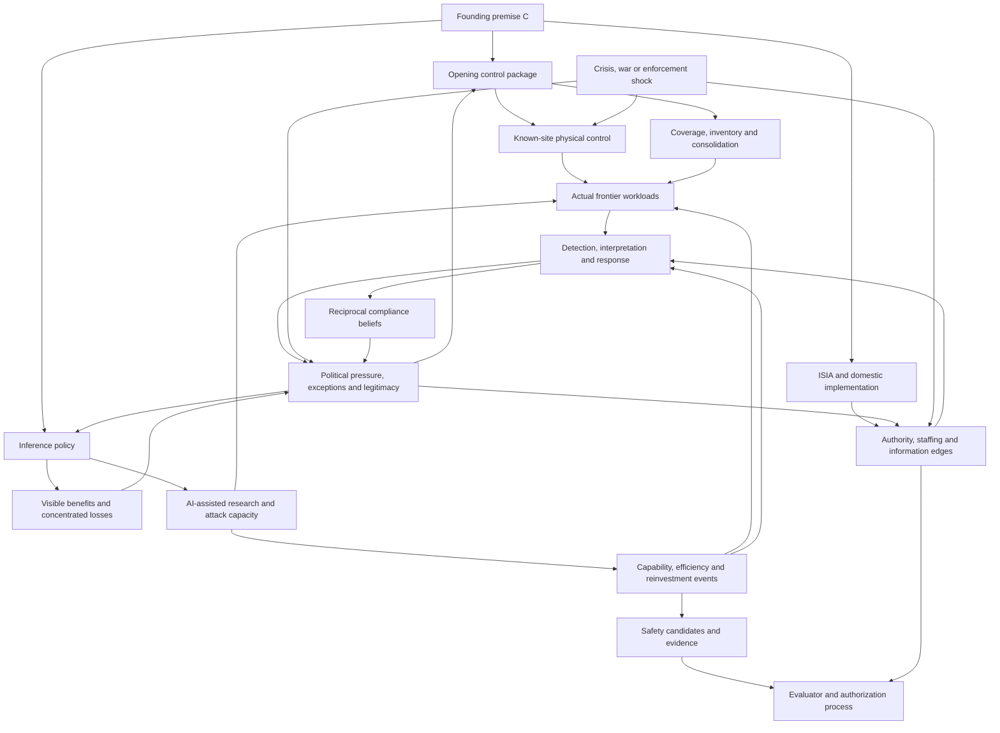

# Symbolic stochastic expert model

Status: review scaffold and project synthesis, not a calibrated forecast and not
the game engine. Its purpose is to expose the conditional structure that future
probability judgments would complete.

## 1. Formal shape

Let the founding premise be (C): on 1 August 2026, the US and China are active
signatories, ISIA exists, top leaderships accept the pause rationale, and known
frontier sites are reachable. This is a game conditioning premise, not the
project's forecast of real treaty formation.

The expert model is a set of possible causal models rather than one complete
joint distribution:

```text
H = {
  H_cap: capability production and paradigm,
  H_reinvest: cognitive-reinvestment routes and carriers,
  H_control: compute-control, detection and evasion,
  H_pol: institutions, actors, opinion and crisis response,
  H_safe: existence and recognizability of adequate safety routes
}

S_0 = legal, physical, technical, organizational and information state at founding
π_t = policy and contingent response chosen by DG/states
A_t = actor beliefs, preferences, authority, resources and conduct
U_t = external shocks and events inside a sampled world

(S_(t+1), A_(t+1), O_(t+1)) ~ M_H(S_t, A_t, π_t, U_t)
```

The project does not yet assert a single prior (P(H)). It currently supplies:

- structural constraints;
- qualitative likelihood orderings;
- conditional arrows and sign-reversing hypotheses;
- broad expert judgments already stated by Jörn;
- unweighted adversarial families; and
- placeholders for later elicitation.

The game will eventually need a complete distribution over the subset of worlds
it samples. That distribution may deliberately condition on an easier technical
subset or transform frequencies for playability. It must not be mislabeled as
the expert model.

## 2. First-year process graph



The graph is cyclic because political feedback, technical adaptation, and
verification repeat. Each box references a dense submodel; the graph is not a
request to assign one scalar to each box.

## 3. Conditional first-year likelihood ledger

Window: 1 August 2026–31 July 2027. Information date: 11 July 2026.

Vocabulary:

- **structurally expected:** appears in most live models conditional on (C);
- **central:** part of the current default trajectory;
- **live:** plausible enough to represent or stress-test, but not central;
- **tail, decision-relevant:** currently judged less likely but important enough
  to shape robust policy;
- **unresolved:** even the qualitative rank depends on missing frontier judgment.

These labels are ordinal only, not hidden numeric bins. Except where the founding
premise logically supplies the event, the current assignments are provisional
project inferences (`I`) offered for review—not source-bounded rates, Jörn's
endorsed estimates, or expert consensus.

| Event/path during year one | Current ordinal status | Basis | Why / major condition |
| --- | --- | --- | --- |
| Known frontier operators acknowledge a stop and receive on-site control or monitoring | Structurally expected | `C -> I` | Follows from the founding premise and immediate reach of a small number of visible sites; actual stop authority still matters |
| Control remains uneven between known commercial sites and military, covert, distributed or foreign resources | Structurally expected | `I` | Universal inventory, access, technical assurance and consolidation take longer than site-specific action |
| Serious disputes shift toward inference, post-training, exceptions, custody, evidence access and military scope | Structurally expected | `I` | These choices determine the physical regime once “pause” is accepted in the abstract |
| At least one material implementation delay, ambiguity or partial failure | Central | `I`, review hypothesis | Novel authority, technical verification and asymmetric organizations create several ordinary failure surfaces |
| Repeated US–China bargaining over access, evidence or symmetry without explicit intent to build ASI | Central | `I`, review hypothesis | Disagreement can concern sovereignty, proof and implementation while shared catastrophe belief persists |
| Concentrated industry/user opposition to some restrictions | Central | `I`, review hypothesis | Losses are visible and organized; mass-public salience and political dominance remain uncertain |
| Inference rules are relaxed, tightened or receive named exceptions after opening implementation | Central under cold/restricted starts; live under broad start | `I`, review hypothesis | Policy feedback and bargaining are plausible; direction depends on observed costs, incidents and institutional leverage |
| Substantial declared-site consolidation/custody progress | Central | `C -> I` | Treaty design targets it, but “substantial” must be operationalized before numeric elicitation |
| Comprehensive coverage of military, covert, loose, reconstructed and distributed capacity | Not central; live as a claimed achievement | `I` | Completeness is difficult to establish and may be confused with absence of detected violations |
| A false positive, ambiguous anomaly, filtered report or disputed interpretation creates a bilateral incident | Live | `I`, mechanism-supported | Several evidence paths can produce the same visible concern; frequency is uncalibrated |
| A military/intelligence exemption or poorly observed channel materially weakens coverage | Live | `I`, mechanism-supported | Sub-state actors, secrecy and emergency authority are load-bearing, but incidence needs domain judgment |
| Broad inference materially accelerates algorithmic research or evasion within the year | Live-to-central conditional on broad access; magnitude unresolved | `J + I`, conditioning incomplete | Jörn expects a large survival effect over the pause, but task-level uses and year-one timing need elicitation |
| Allowed work produces a real but bounded cognitive/research improvement that later fizzles | Live | `I`, structurally permitted | The model explicitly permits bottleneck release without unbounded recursion |
| An insight moves from context-local to communicable/scaffold/successor form | Unresolved | `X` | Carrier transition and observability are frontier technical cruxes |
| Institutionally confident but objectively wrong technical/safety assessment | Live as a path; occurrence rank unresolved | `I`, mechanism-supported | Ordinary correlated-error and selection mechanisms exist, but target-domain evidence is weak |
| A genuine adequate and recognizable safety solution leads to a decisive authorized build | Tail or unresolved | `J + I`, frontier ontology incomplete | The default alignment model is pessimistic; the game may condition on easier worlds, but the winning ontology is not settled |
| A covert or ambiguously authorized project crosses a decisive takeoff threshold | Tail, decision-relevant | `I`, review hypothesis | Strong opening control makes this noncentral, while threshold and access uncertainty prevent dismissal |
| Improvement occurs wholly inside one permitted inference episode and outruns external response | Tail or unresolved, decision-relevant | `J + I`, frontier ontology incomplete | Depends on internal cognitive routes and access; could invalidate the normal response-time abstraction |
| Taiwan/war disrupts access and continuity while leaders retain catastrophe belief | Tail, decision-relevant | `I`; geopolitical incidence separate | Ordinary geopolitical incidence is separate from the conditional organizational pathway |
| Explicit rapid bilateral abandonment of the pause | Tail under the founding premise | `I`, review hypothesis | More gradual impairment, exemptions and operational failure are currently more central paths |

## 4. Policy-conditioned arrows

The following are qualitative hypotheses for review, not settled signs in every
world.

### Cold versus broad inference

```text
cold inference
  -> lower current service benefit and stronger concentrated opposition
  -> fewer cheap AI-assisted experiments, weaker cyber/operational assistance,
     less cover traffic and smaller credential/weight surface

broad inference
  -> higher current benefit and possibly a more defensible narrow training red line
  -> more research throughput, attack capability, ambiguity and exception pressure
```

The net effect on treaty durability is structurally ambiguous. The technical
hazard is expected to be higher under broad access, but its size and timescale
are unresolved.

### Monitoring versus factual custody

```text
monitor + legal enforcement
  -> rapid, lower-disruption coverage of obvious sites
  -> depends on workload classification and response latency

factual custody of power/credentials/access
  -> less dependence on recognizing a prohibited workload in real time
  -> higher implementation, legitimacy, insider, host-state and concentration costs
```

These are configurations, not a one-dimensional strength ladder. Consolidation,
component removal and destruction change reconstruction time and incomplete-
inventory risk again.

### Domestic versus cross-national verification

```text
cross inspection
  -> potentially better reciprocal confidence and independent evidence
  -> greater sovereignty, espionage and wartime-continuity cost

domestic-only inspection
  -> easier implementation and secrecy protection
  -> weaker assurance against state breakout and more dependence on trust/reporting
```

Either can succeed in a compliant world. Robustness depends on which actor and
failure paths the regime must survive.

## 5. Numerical completion without pretending it is truth

For each event (E_i), later elicitation should record:

```text
event definition and resolution
starting state C and policy π
qualitative rank
P(E_i | do(π), C, H_k) for each live structural family H_k, if elicitable
expert weight or credal range over H_k, if defensible
observation/detection/report probabilities separately
correlations and shared parents
game sensitivity and intended use
```

Do not start by asking for the probability of “treaty failure.” Decompose it into
legal invalidation, deliberate withdrawal, exemption/erosion, subordinate
conduct, physical control loss, technical evasion, false-positive escalation,
and evaluator failure. Retain bypass paths and competing risks.

## 6. High-level review questions now worth human time

1. Which first-year ordinal labels above are plainly wrong by at least one tier?
2. Which omitted first-year event would carry at least five percent probability
   in Jörn's conditional model or would strongly alter a robust opening policy?
3. Conditional on cold, restricted and broad inference, which three technical
   or political mediators dominate the difference by July 2027?
4. Among military scope, covert compute, workload ambiguity, insider conduct,
   distributed training and enforcement delay, which residual path is most
   likely to matter during year one under immediate known-site monitoring?
5. Which apparently separate events share a latent cause strongly enough that
   sampling them independently would produce nonsense?
6. Which rows should remain unquantified adversarial cases rather than enter a
   playable run distribution?
